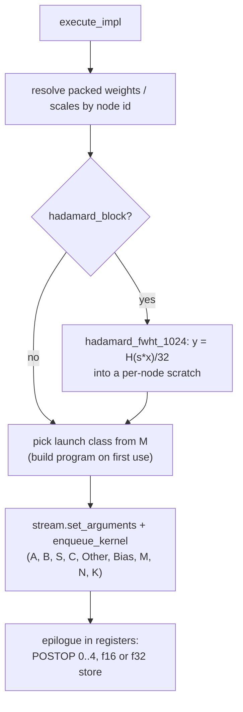

# TernOCL int2 FullyConnected — Architecture

How 2-bit (ternary) `FullyConnected` layers are executed by the TernOCL OpenCL
kernels inside the OpenVINO GPU plugin.

---

## 1. Overview

Ternary models store each weight as one of `{-1, 0, +1}` with one fp16 scale
per group of 128 along K. OpenVINO has no signed 2-bit type, so they are carried
in the IR as unsigned `u2` codes `{0,1,2}` with a scalar zero point of 1,
dequantized as `(code - 1) * scale`.

The implementation:

1. **At compile time** converts those constants once into the layout the
   kernels read, so inference performs no unpacking or reordering.
2. **At execution time** enqueues one OpenCL GEMM per layer on the plugin's own
   command queue, applying the fused post-op in the kernel epilogue and writing
   the output type the consumer wants.
3. **Per shape and M** selects a tile configuration from tuned tables.

The kernels are the TernOCL **int2 x f16 up-convert** kernels: the 2-bit
weights are dequantized to fp16 in registers (the group scale is folded in with
integer ops) and multiplied on the fp16 DPAS with fp32 accumulation, against
native fp16 activations. They come from the TernOCL kernel collection
(`int2_fp16_upcvt/int2_fp16_upcvt.cl`, `common/epilogue.clh`,
`hadamard/hadamard_fwht.cl`), which carries its own standalone drivers,
validation and benchmarks against XeTLA.

| File | Role |
|---|---|
| `impls/ocl_v2/ternocl_int2/fully_connected_ternocl_int2.hpp` | Registration, acceptance rules, fused-chain -> epilogue mapping |
| `impls/ocl_v2/ternocl_int2/fully_connected_ternocl_int2.cpp` | Weight packing, program cache, tile tables, execution |
| `impls/ocl_v2/CMakeLists.txt` | Embeds the TernOCL sources as string literals at configure time |
| `thirdparty/TernOCL` | Submodule: [TernOCL](https://github.com/libxsmm/TernOCL) kernels, drivers, validation, tuning scripts |
| `plugin/transformations/fuse_hadamard_fc.cpp` | Folds the graph-level rotation of rotated-basis checkpoints into the FC (section 7) |
| `plugin/transformations/fuse_rms_rope.cpp` | Optional fold of the per-head Q/K RMSNorm into RoPE (`OV_GPU_FUSE_RMS_ROPE=1`) |
| `registry/fully_connected_impls.cpp` | Priority relative to oneDNN/OpenCL |
| `primitive_inst.cpp` | Lets `ternocl_int2` keep its fused chain under dynamic shapes (section 4) |

There is no SYCL or XeTLA dependency; the impl needs only the plugin's OpenCL
runtime (`GPU_RT_TYPE=OCL`).

---

## 2. Registration and acceptance

`TernoclInt2FCImplementationManager` (`impl_types::ocl`) is registered for
`FullyConnected` ahead of the oneDNN and stock OpenCL managers, for dynamic and
static shapes, when the plugin is built on the OpenCL runtime.

`validate_impl` accepts a node only when every assumption the kernels make
holds; anything else falls through to the existing paths unchanged:

- weights are a constant `u2` `[N, K]` with `K % 128 == 0` and `N % 16 == 0`
  (one lane per output column; the kernels clip partial tiles, so N is not padded)
- activations are `f16`, `bfyx`, unpadded; output is `f16` or `f32`, `bfyx`, unpadded
- the fused chain maps onto one epilogue (`ternocl_int2_postop()`):

| Fused chain | Typical layer | `POSTOP` |
|---|---|---|
| none | | 0 |
| `swish`, then `eltwise prod` | gate_proj x up_proj | 1 |
| `eltwise sum` | o_proj, down_proj (residual add) | 2 |
| constant bias (same type as the output), nothing fused | GatedDeltaNet `in_proj_a` | 3 |
| `logistic` | GatedDeltaNet `in_proj_b` | 4 |

  and the eltwise operand is `f16`. `OV_TERNOCL_INT2_FOLD_GATES=bias|sigmoid|none`
  narrows the bias/sigmoid folds (default: both).

A node whose primitive carries a Hadamard input transform (section 7) is
rejected with an error rather than falling through, because no other
implementation applies the transform.

---

## 3. Compile-time preparation

Performed once per node in `create()`:

- **Weights**: read from their `data` node with a blocking copy, re-encoded from
  `code - zp` to two's complement (`-1` as `0b11`) and packed 16 values per
  `uint32`, K-major: word `(k/16, n)` holds rows `16*(k/16) .. +15` of column n,
  row `16*kb+j` at bits `[2j, 2j+1]`. The result is a `[K/16, N]` USM device buffer.
- **Scales**: OpenVINO stores them `[N, K/128]`; the kernels want `[K/128, N]`,
  transposed once into a device buffer.
- **Hadamard signs** (rotated checkpoints): the `+-1` vector as `i8[K]` on the device.

OpenVINO caches `primitive_impl` objects by `kernel_impl_params`, so one impl
object can serve several nodes of identical shape. The packed buffers therefore
live in a process-wide map keyed by node id and are resolved per execution; the
impl keeps its own copy as a fallback for a renamed node.

---

## 4. Execution

`M` is derived from the output shape, so one impl serves prefill and decode.
Kernels are launched through the plugin stream (`set_arguments` /
`enqueue_kernel`), so they take part in the normal in-order / out-of-order
event handling and cost no host synchronisation.

**Programs** are built with `clBuildProgram` on the engine's `cl_context`, once
per (source, option string), and cached process-wide; each impl creates its
`cl_kernel` from them on first use of a launch class. Clones share the kernel
handles, like the stock OpenCL impls: OpenVINO clones cached impls on every
shape update.

**Fusion under dynamic shapes**: `primitive_inst::is_valid_fusion()` only
trusts fused eltwise ops on `impl_types::ocl` FCs whose kernel it knows and
otherwise silently executes an *unfused subgraph* (the FC plus separate
eltwise/activation primitives). `ternocl_int2` is whitelisted there; without it
the model runs every epilogue as a separate pass (Bonsai 2 27B on a B70:
34.6 instead of 42.8 tok/s, TTFT 620 instead of 86 ms).

**Output type**: f32 logits are written directly (`-DOUT_F32`), the
accumulator is fp32 already.

---

## 5. Kernels

Both kernels live in one program source, `int2_fp16_upcvt.cl`, specialised with
`-D` options:

| Kernel | Used for | Options |
|---|---|---|
| `int2_fp16_upcvt_gemm` | GEMV, M <= 8 | `SGM` rows per sub-group (1/2/4/8), `NSG_N` sub-groups along N (work-group width `WGN = 16*NSG_N`), `LS` local k-slicing through SLM, `U` k-steps loaded ahead |
| `int2_fp16_upcvt_gemm_mt` | M > 8 | sub-group tile `MT_M x MT_N`, work-group `WG_M x WG_N` sub-groups, 256 GRF; B dequantized once per 16 columns and reused for all `MT_M/8` DPAS row blocks; 2D block I/O clips at the matrix edge so any M works |

Both take `POSTOP` (0..4) and `OUT_F32`, and the epilogue
(`common/epilogue.clh`) is bit-identical to XeTLA's tile ops (`silu_op_t`,
`elemwise_reduce_op_t`, `xetla_sigmoid` including its `x <= -10 -> 0` clamp);
TernOCL's parity tool checks this against the XeTLA kernel on the same inputs.

`hadamard_fwht_1024` (`hadamard/hadamard_fwht.cl`): one 128-item work-group per
1024-block, the ten radix-2 stages as three radix-8 passes through SLM and a
final radix-2 pass that scales and stores, fp32 butterflies. Same stage order
as the SYCL kernel it replaces, so the rotated activation is bit-identical.

---

## 6. Configuration selection

`get_launch()` maps M to a launch class and builds its kernel on first use:

| M | Kernel | Tile |
|---|---|---|
| 1 | GEMV, `SGM` = 1 | `gemv_tile(K, N)`: exact (K, N) entries, separate table for the integrated GPU |
| 2..8 (MTP verify, M = k+1) | GEMV with `SGM` = 2/4/8, or M-tiled with an 8-row tile | `small_tile(K, N, M)`: exact (K, N, M) entries, B70 M = 2..8, Arc 140V M = 2..4; otherwise the M = 1 tile with the default `SGM` |
| 9..16, 17..32, 33..63 | M-tiled | `mt_tile()`: one tile per M band and output width class (N <= 8192, < 65536, >= 65536), per GPU class |
| >= 64 | M-tiled | `mt_tile()`: exact (K, N) entries tuned at M = 1024 (B70) / 512 (Arc 140V) |

Tuned on an Arc Pro B70 with TernOCL's `bench.sh` / `sweep_midm.sh` (>= 2 GiB of
rotating distinct weights, median of 3, device-event time), for the Bonsai 8B
and 27B shapes. Measured against XeTLA's own tuned configurations on the same
harness (B70):

| | TernOCL vs XeTLA |
|---|---|
| decode GEMV, 27B shapes | x1.01 - x1.06 |
| prompt-length M 12..48, 27B shapes | x1.0 - x3.5 |
| M = 1024 | x4.4 - x4.9 |

Overrides for sweeps: `OV_TERNOCL_INT2_GEMV="wgn,ls,u"`,
`OV_TERNOCL_INT2_MID="mt_m,mt_n,wg_m,wg_n"` (M < 64),
`OV_TERNOCL_INT2_MT="..."` (M >= 64); `OV_TERNOCL_INT2_CFG_DEBUG=1` prints every
built program and chosen tile.

---

## 7. Rotated-basis checkpoints (Hadamard input transform)

Bonsai 2 stores its ternary weights in a rotated basis: every folded
projection expects its input `x` replaced by `H_1024 (s * x) / 32`, per
1024-wide block along K with a fixed `+-1` sign vector `s`. In the IR this
arrives as `[Multiply(s)] -> Reshape(..., K/1024, 1024) -> MatMul(H) -> Reshape(..., K)`
in front of the compressed FC (produced by `tools/int2/bonsai2_gguf_to_ir.py`).

`FuseHadamardIntoFC` (registered after the horizontal FC fusion, so a merged
gate/up FC absorbs the shared rotation once) recognises the chain, verifies the
constant is the normalised Sylvester `H_1024`, rewires the FC to the original
activation and records `int2_hadamard_block` / `int2_hadamard_signs` in the
rt_info; the FC translator moves them onto the cldnn `fully_connected`
primitive (part of its hash and serialization). At execution the impl runs
`hadamard_fwht_1024` into a per-node scratch and points the GEMM at it.
`OV_TERNOCL_INT2_FUSE_HADAMARD=0` leaves the rotation in the graph;
`OV_TERNOCL_HADAMARD_DEBUG=1` traces the match.
