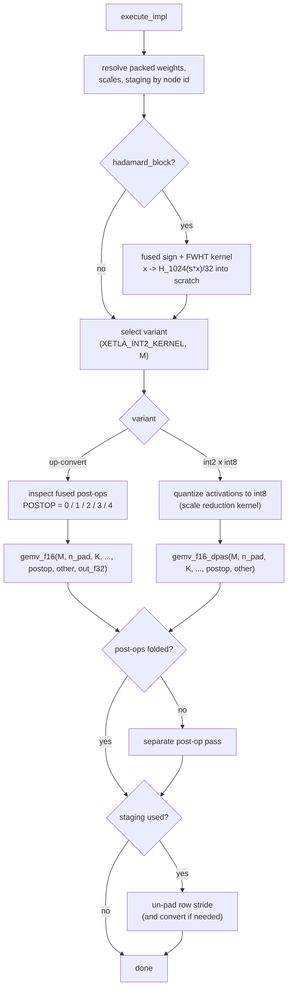

# XeTLA int2 FullyConnected — Architecture

How 2-bit (ternary) `FullyConnected` layers are executed by XeTLA kernels inside
the OpenVINO GPU plugin.

---

## 1. Overview

Ternary models store each weight as one of `{-1, 0, +1}` with a per-group fp16
scale. OpenVINO has no signed 2-bit type, so they are carried in the IR as
unsigned `u2` codes `{0,1,2}` with a scalar zero point of 1, dequantized as
`(code - 1) * scale`.

The implementation does three things:

1. **At compile time**, converts those constants once into the exact layout the
   kernels read, so inference performs no unpacking, reordering or allocation.
2. **At execution time**, launches a single XeTLA GEMM per layer, applying the
   SiLU and residual post-ops and producing the output type the consumer wants.
3. **Per shape**, selects a tile and k-slicing configuration from a table of
   tuned entries.

Two kernel variants implement step 2. Both run on DPAS and differ in the operand
types fed to it:

| Variant | Weights | Activations | MMA |
|---|---|---|---|
| **up-convert** (default) | dequantized to fp16 in registers | native fp16 | fp16 DPAS |
| **int2 x int8** | consumed as 2-bit directly | quantized to int8 | integer DPAS |

Up-convert is accurate and is the fast choice for batch-1 decode. int2 x int8 is
faster on the large GEMMs of a long prefill but costs roughly an order of
magnitude more relative error per GEMM, because it quantizes the activations.
Section 7 covers how the variant is chosen at runtime; the rest of this document
notes where the two differ.

| File | Role |
|---|---|
| `impls/sycl/fully_connected_xetla_int2.hpp` | Registration and acceptance rules |
| `impls/sycl/fully_connected_xetla_int2.cpp` | Weight packing, buffers, execution, variant dispatch |
| `impls/sycl/xetla/xetla_int2_gemv.cpp` | Up-convert kernel, epilogue, tuning table |
| `impls/sycl/xetla/xetla_int2_dpas.cpp` | int2 x int8 kernel and its activation-scale reduction |
| `impls/sycl/xetla/hadamard_fwht.cpp` | Fused sign flip + blockwise Walsh-Hadamard input transform (rotated-basis checkpoints, section 8) |
| `plugin/transformations/fuse_hadamard_fc.cpp` | Folds the graph-level rotation into the `FullyConnected` primitive |
| `plugin/transformations/fuse_rms_rope.cpp` | Optional fold of the per-head Q/K RMSNorm into the RoPE kernel (`OV_GPU_FUSE_RMS_ROPE=1`) |
| `registry/fully_connected_impls.cpp` | Priority relative to oneDNN/OpenCL |

XeTLA is used as an unmodified header-only template library.

---

## 2. Registration and acceptance

`XetlaInt2FCImplementationManager` is registered for `FullyConnected` ahead of
the oneDNN and OpenCL managers, for both dynamic and static shapes:

```cpp
OV_GPU_CREATE_INSTANCE_SYCL_OCL(cldnn::sycl::XetlaInt2FCImplementationManager, shape_types::dynamic_shape)
OV_GPU_CREATE_INSTANCE_SYCL_OCL(cldnn::sycl::XetlaInt2FCImplementationManager, shape_types::static_shape)
OV_GPU_CREATE_INSTANCE_ONEDNN(onednn::FullyConnectedImplementationManager, shape_types::static_shape)
OV_GPU_GET_INSTANCE_OCL(fully_connected, ...)
```

`validate_impl` accepts a node only when every assumption the kernels make
holds; anything else falls through to the existing paths unchanged:

- weights are constant, `u2`, shaped `[N, K]`, with `K % 128 == 0`
- activations are `f16`, `bfyx`, unpadded
- output is `f16` or `f32`, `bfyx`, unpadded
- a constant bias only when nothing else is fused after it and the up-convert
  variant is selected (it is folded into the epilogue, `POSTOP = 3`)
- fused primitives limited to a trailing `swish`, a trailing `logistic`
  (sigmoid, `POSTOP = 4`), or an `eltwise` `sum`/`prod` with an f16 outer
  dependency

`OV_XETLA_INT2_FOLD_GATES=bias|sigmoid|none` narrows the bias/sigmoid folds
(default: both), which the GatedDeltaNet gate projections `in_proj_a` /
`in_proj_b` of the hybrid 27B rely on.

Acceptance is conservative and per-node, so the path is incremental: a layer
that does not qualify simply runs as before. Acceptance does not depend on the
variant; both consume the same packed buffers. One exception: a node whose
primitive carries a Hadamard input transform (section 8) is rejected with an
error rather than falling through, because no other implementation would apply
the transform.

---

## 3. Compile-time preparation

Performed once in `create()`, and shared by both variants.

### 3.1 Reading the constants

Weights and scales are read from their `data` nodes with explicit blocking
copies (`copy_to(stream, ..., true)`) into host buffers.

### 3.2 Re-encoding and VNNI16 packing

The kernels consume ternary values in 2-bit two's complement (`-1` as `0b11`),
16 values per `int32`, laid out K-major so a subgroup reads contiguous words:

```cpp
const int32_t code = read_u2(src, n * K + k) - zp;         // {0,1,2} - 1 -> {-1,0,+1}
dst[(k / kPackFactor) * n_stride + n] |= (code & 0x3) << (2 * (k % kPackFactor));
```

with `kPackFactor = 16` and `kGroupSize = 128`. The result is an
`[K/16, n_pad]` `int32` buffer in USM device memory.

### 3.3 N padding

`N` is padded up to a multiple of 64 — the workgroup tile width — so the kernel
stays on its aligned epilogue:

```cpp
const size_t n_pad = (N + 63) & ~static_cast<size_t>(63);
```

Padded columns are zero-filled by the packer and contribute nothing. The
packing stride is stored on the implementation alongside the buffers, so the
weights are always read back with the stride they were written with.

### 3.4 Scales

OpenVINO stores scales per output channel as `[N, K/group]`; the kernels want
`[groups, n_pad]`, so they are transposed once into a padded device buffer:

```cpp
scale_host[g * n_pad + n] = scales_are_n_major ? src[n * groups + g] : src[g * N + n];
```

These are the weight scales. The int2 x int8 variant additionally needs
activation scales, which cannot be precomputed; see section 5.2.

### 3.5 Staging buffers

When `n_pad != N` or the consumer wants f32, a staging buffer of `[M, n_pad]`
is allocated at compile time. The GEMM writes there and a short kernel removes
the row padding, so inference never allocates.

A configuration that uses different variants for prefill and decode also
allocates a single-row f32 staging buffer for decode. The output type is derived
from the buffer actually in use.

### 3.6 Packed-buffer cache

OpenVINO caches `primitive_impl` objects by `kernel_impl_params`, so a single
implementation object can serve several `FullyConnected` nodes of identical
shape. Packed weights therefore cannot live solely on the implementation: they
are held in a process-wide map keyed by node id, and each execution resolves
its own node's buffers. Entries are created once per node and reused
thereafter, so the buffers a running implementation uses remain stable for the
lifetime of the model.

### 3.7 Hadamard input transform (rotated-basis checkpoints)

When the primitive carries `hadamard_block` (section 8), `create()` also
uploads the `+-1` sign vector (`int8[K]`, absent when the signs were folded
into the producing weight) and allocates an `[M, K]` f16 scratch that receives
the transformed activation; the GEMV reads that scratch instead of the node's
input. Both live in the same node-id cache entry and, as a fallback for a cache
miss (a node renamed after compile), on the implementation itself.

---

## 4. Execution path



`M` is derived from the output shape, so one implementation serves both prefill
(`M > 1`) and decode (`M = 1`), and the variant may differ between them.

### Post-op fusion

Post-ops are read from `params->fused_desc` and mapped onto compiled epilogue
variants, with the second operand taken from the fused primitive's outer
dependency:

| Graph pattern | Typical layer | `POSTOP` |
|---|---|---|
| `swish` then `eltwise prod` | gate_proj x up_proj | 1 |
| `eltwise sum` | o_proj, down_proj (residual add) | 2 |
| constant bias | GatedDeltaNet `in_proj_a` | 3 |
| `logistic` | GatedDeltaNet `in_proj_b` | 4 |

With `OV_XETLA_INT2_MERGE_MLP=1` the plugin's horizontal FC fusion merges the
parallel gate/up projections into one 2N-wide compressed FC followed by the
existing SwiGLU primitive, so the weights are streamed once per token; the
default GEMV tuning table has entries for the merged shapes.

Folding removes a full-tensor read-modify-write pass per layer: the activation
and the residual add are applied in registers while the accumulator tile is
still live. The epilogue is compiled for both variants. Up-convert folds by
default; the int2 x int8 variant runs the separate pass unless
`OV_XETLA_INT2_DPAS_FOLD` is set.

### Output type

Where the consumer wants f32 logits, the up-convert kernel is instantiated with
an f32 `C` type and stores directly; its accumulator is f32 already. Under the
int2 x int8 variant the un-padding pass performs the conversion.

---

## 5. Kernel structure

### 5.1 Up-convert

`int2_upcvt_gemm_impl` is templated on tile shape, k-slicing, output type and
post-op:

```cpp
template <typename XT, int WGM, int WGN, int SGM, int SGN, int SGK,
          int KS, int LS, bool kUnaligned, typename CT = XT, int POSTOP = 0>
```

- `XT` — activation/scale type (`fp16`)
- `CT` — output type (`fp16`, or `float`); `using data_type_c = CT`
- `WGM/WGN`, `SGM/SGN/SGK` — workgroup and subgroup tile shape
- `KS`, `LS` — global and local k-slicing factors
- `POSTOP` — selects the epilogue

The epilogue is composed at compile time from XeTLA's existing tile-op building
blocks:

```cpp
using tile_op_t = std::conditional_t<POSTOP == 1,
    chained_tile_op_t<silu_op_t, elemwise_reduce_op_t<reduce_op::prod, XT, Xe>>,
    chained_tile_op_t<elemwise_reduce_op_t<reduce_op::sum, XT, Xe>>>;

using epilogue_policy = std::conditional_t<POSTOP != 0,
    epilogue_policy_tile_op<tile_op_t, arch_tag>,
    /* default store-only policy */>;
```

Weights are upconverted from 2-bit to fp16 in registers and multiplied by their
group scale before the DPAS, so the mainloop runs as a standard fp16 GEMM.

### 5.2 int2 x int8

`DpasFp16Cfg<POSTOP>` carries the tile shape and feeds the integer DPAS
pipeline. Like the up-convert kernel it is tuned per shape; this integration
compiles a single tuned configuration (`wg 64x256`, `sg 8x128`, `sg_k 64`)
rather than dispatching from a table. It runs in two steps:

1. A reduction kernel computes per-(row, K-group) activation scales as a
   forward quant factor, `127 / absmax`, into a process-wide scratch buffer.
2. The GEMM consumes the 2-bit weights, their fp16 group scales, and those
   activation scales, accumulating in `int32`.

It uses the same `epilogue_t` template as the up-convert path, instantiated with
either the default store-only policy or the same tile-op policy, selected by
`POSTOP`.

### Kernel naming

Both variants are launched as named SYCL kernels
(`parallel_for<int2_upcvt_kernel_tag<...>>`,
`parallel_for<int2_fp16_dpas_kernel_tag<POSTOP>>`), keeping every instantiation
distinct within the module.

---

## 6. Configuration selection

Both variants are tuned per shape. The shape-keyed dispatch below is wired for
the up-convert variant; the int2 x int8 variant currently compiles one tuned
configuration (section 5.2), and a table for it would follow the same pattern.

`gemv_f16` selects a configuration from a table keyed on shape. Decode
(`M = 1`) shapes are matched exactly; anything else falls back to generic tiers
by output width.

The entries below are an **example table, tuned on a B70** for a 4096-wide
hidden size. They are illustrative, not universal: the winning tile and
k-slicing factor depend on the memory bandwidth and EU count of the part, so a
different GPU should be re-swept rather than assumed to match.

| Layer | N | K | WGN | KS | LS |
|---|---|---|---|---|---|
| qkv (fused) | 6144 | 4096 | 32 | 1 | 4 |
| gate/up | 12288 | 4096 | 32 | 1 | 2 |
| o_proj | 4096 | 4096 | 32 | 1 | 8 |
| down_proj | 4096 | 12288 | 32 | 1 | 8 |
| lm_head | 151680 | 4096 | 32 | 1 | 4 |

Narrow workgroups (`WGN = 32`) suit GEMV, where parallelism across `N` matters
more than tile reuse; the local k-slicing factor `LS` balances the K reduction
against subgroup occupancy and is tuned per shape.

The dispatcher distinguishes integrated from discrete Xe2 (`is_integrated_gpu`)
and keeps a separate decode table for Lunar Lake, whose bandwidth is several
times lower than the B70's (see the build-and-run document for the tuned
tiles). `XETLA_INT2_CFG_DEBUG=1` prints the selection;
`XETLA_INT2_DECODE_CFG` / `XETLA_INT2_OPROJ_CFG` override it for sweeps.

K-slicing scratch is a single process-wide buffer that only grows, sized for
the worst case across the compiled instantiations that the current `M` can
reach (prefill never k-slices, so it does not pay for the decode tiers).

### Prefill (`M > 1`)

Every `M > 1` call on the up-convert path runs a real M tile on the fp16 DPAS
(`WGM` 8 for `M <= 8`, 16 for `M <= 16`, else 32; `WGN` 64, `SGM` 8, `SGN` 16,
`SGK` 128, no k-slicing): one pass over the weights per row tile instead of
one per token. It is bit-identical to the GEMV tier at every `M` and, on the
27B, 5-7x faster at chat-length prompts and 4x faster than the earlier
128-wide GEMM tile at `M >= 128` (~2.5 ms/token on a B70).
`XETLA_INT2_PREFILL_CFG=-1` restores the per-row GEMV tier, `-2` the old wide
tile, for A/B measurements. Outputs narrower than 64 (`N % 64 != 0`, e.g. the
GDN beta projection) keep the GEMV tier.

---

## 7. Choosing a variant at runtime

`XETLA_INT2_KERNEL` selects the variant, per process:

| Value | Prefill (M>1) | Decode (M=1) |
|---|---|---|
| `upcvt` (default) | up-convert, fp16 DPAS | up-convert, fp16 DPAS |
| `dpas_prefill` | int2 x int8 DPAS | up-convert, fp16 DPAS |
| `dpas` | int2 x int8 DPAS | int2 x int8 DPAS |

The best variant depends on prompt length and on the target device, so it should
be measured rather than assumed.

---

## 8. Rotated-basis checkpoints (Hadamard input transform)

Bonsai 2 stores its ternary weights in a rotated basis: every folded projection
expects its input `x` to be replaced by `H_1024 (s * x) / 32`, applied per
1024-wide block along `K` with a fixed `+-1` sign vector `s`, and the token
embedding is stored rotated. In the IR this arrives as
`[Multiply(s)] -> Reshape(..., K/1024, 1024) -> MatMul(H) -> Reshape(..., K)`
in front of the compressed `FullyConnected` (produced offline by
`tools/xetla_int2/bonsai2_gguf_to_ir.py`, which also folds most sign vectors
into the preceding RMSNorm weights or `up_proj` rows and applies the inverse
rotation to the embedding table).

`FuseHadamardIntoFC` (a model pass registered after the horizontal FC fusion,
so a merged gate/up FC absorbs the shared rotation once) recognises that chain,
verifies the constant is the normalised Sylvester `H_1024`, rewires the FC to
the original activation and records `hadamard_block` / `hadamard_signs` on the
`FullyConnectedCompressed` rt_info; the FC translator moves them onto the cldnn
`fully_connected` primitive (part of its hash and serialization).

At execution the implementation runs `hadamard_fwht.cpp` in front of the GEMV:
one work-group of 128 items per 1024-block, the ten radix-2 stages as four
register passes (three radix-8 gathers through SLM and a final radix-2 pass
that scales and stores), fp32 butterflies with fp16 only at load and store. At
decode it is launch-bound; on the 27B the fused path recovers the ~12% that
the graph-level rotation cost (39.7 -> 44.7 tok/s on a B70).
`OV_XETLA_INT2_FUSE_HADAMARD=0` leaves the rotation in the graph;
`OV_XETLA_HADAMARD_DEBUG=1` traces the match.
